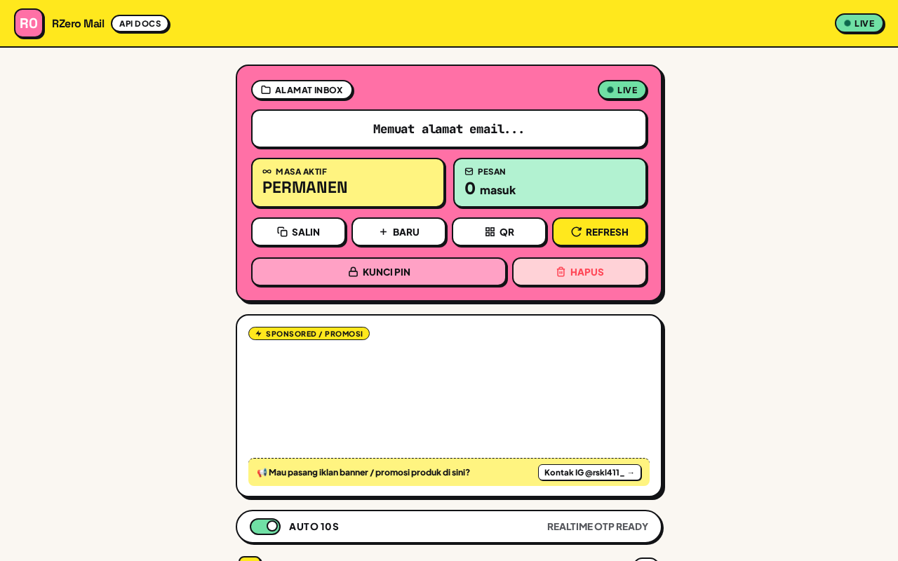
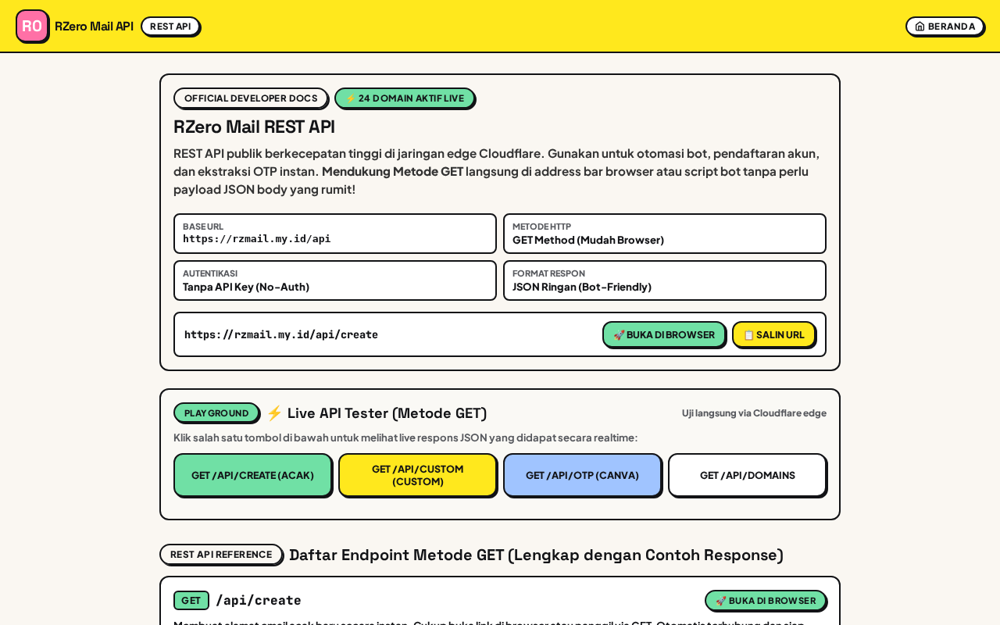

# RZero Mail

> High-Voltage Serverless Disposable Email & Automated OTP Extraction Engine built on Cloudflare Edge (Workers, D1 SQLite & Anycast Email Routing).

[](https://opensource.org/licenses/MIT)
[](https://workers.cloudflare.com/)
[](https://hono.dev)
[](#api-reference-get-method)
[](https://rzmail.my.id/)
[](https://rzmail.my.id/docs)

RZero Mail is a production-ready, open-source temporary disposable email service engineered specifically for high-speed automated bot workflows, account registration pipelines, and privacy protection. 

Unlike traditional disposable email systems that rely on heavy webmail UIs and complex POST payloads, RZero Mail offers a **GET Method REST API**, a context-aware **Instant OTP Extractor**, multi-domain Anycast routing with zero relay delays, PIN-secured private inboxes, and an opinionated **Neo-Brutalism** responsive web interface.

---

## 🎯 Untuk Apa Project Ini Berjalan?

Layanan temporary email publik yang ada saat ini seringkali memiliki kendala mendasar:
* **UI Lambat & Iklan Berlebihan**: Webmail tradisional dipenuhi skrip pelacak dan iklan pop-up yang memperlambat browser.
* **Akses API Terkunci / Berbayar**: Sebagian besar penyedia mengunci akses API atau mewajibkan payload POST dan auth token rumit untuk sekadar membaca pesan masuk.
* **Pemeliharaan Mail Server Konvensional yang Rumit**: Mengelola server Postfix/Dovecot mandiri membutuhkan konfigurasi IP reputasi, pembersihan storage rutin, dan rentan terhadap serangan DDoS.

**RZero Mail** dirancang sebagai solusi infrastruktur email sementara modern:
1. **Serverless Edge-Native**: Menggunakan Cloudflare Workers & Anycast Email Routing, memindahkan pemrosesan email langsung ke edge network global tanpa server fisik mail.
2. **Developer-First (100% GET REST API)**: Seluruh interaksi (generate email, custom inbox, list pesan, ambil OTP) dapat dilakukan via HTTP GET murni—sangat ramah untuk bot Telegram, Discord, cURL, maupun CLI.
3. **Ekstraksi OTP Otomatis**: Dilengkapi regex engine yang langsung membedah dan mengisolasi 4–8 digit kode verifikasi dari isi email ke dalam field JSON terpisah.
4. **Multi-Domain Resiliency**: Mendukung puluhan custom domain dengan pengecekan MX Dual-DoH (Cloudflare + Google DoH) dan auto-resolver Host DNS.

---

## ⚖️ Kelebihan & Kekurangan

| Kategori | Kelebihan (Pros) | Kekurangan (Cons) |
|---|---|---|
| **Kecepatan & Latensi** | **Anycast Edge Speed (<20ms)**: Berjalan di ratusan data center Cloudflare global; penerimaan email dan response API terjadi seketika tanpa jeda antrean server konvensional. | **Inbound Only**: Dikhususkan untuk penerimaan email & verifikasi akun; tidak mendukung fitur kirim email keluar (outbound SMTP). |
| **Integrasi Developer** | **100% GET Method REST API**: Tidak memerlukan API key untuk endpoint publik dan tanpa payload JSON rumit. Cukup panggil URL via browser, bot, atau script terminal. | **Ketergantungan Ekosistem Cloudflare**: Terikat pada Cloudflare Workers, Cloudflare D1, dan Email Routing; butuh adaptasi jika ingin dipindahkan ke VPS biasa. |
| **Biaya & Pemeliharaan** | **Zero Server Maintenance**: Tanpa perlu konfigurasi Postfix/Dovecot atau manajemen storage disk VPS; otomatis auto-scale di infrastruktur Cloudflare. | **Batas Concurrent Write D1**: SQLite D1 memiliki batas throughput write tertentu saat menghadapi lonjakan masif ribuan email masuk secara bersamaan dalam 1 detik. |
| **UI & Keamanan** | **Neo-Brutalism & Triple-Lock Admin**: Tampilan responsif super ringan tanpa framework berat, serta konsol admin terlindungi autentikasi berlapis dan Dual-DoH validator. | **Retensi Temporer**: Data pesan dirancang untuk penggunaan sementara (disposable) dan tidak ditujukan sebagai arsip surat elektronik permanen. |

---

## 🌐 Live Demo & Previews

* **Live Webmail Production**: [https://rzmail.my.id/](https://rzmail.my.id/)
* **Live Interactive API Docs**: [https://rzmail.my.id/docs](https://rzmail.my.id/docs)

### 🖥️ Webmail Dashboard


### 📖 REST API & Live Playground


---

## ⚡ Architecture Overview

```text
[ Inbound Email (Canva / Discord / Social) ]
                     │
                     ▼
       [ Cloudflare Anycast 3-MX Servers ]
   (route1 / route2 / route3.mx.cloudflare.net)
                     │
                     ▼
          [ Cloudflare Email Worker ]
          ├── Inbound MIME Parser (postal-mime)
          ├── Contextual OTP Extractor (Regex Engine)
          └── D1 SQLite Storage Engine (rzero-db)
                     │
         ┌───────────┴───────────┐
         ▼                       ▼
  [ REST API Layer ]     [ Web Client (Edge CDN) ]
  ├── GET Methods        ├── Neo-Brutalism UI
  ├── Anti-DDoS Limiter   ├── Reactive Auto-Refresh
  └── Triple-Lock Admin   └── Live API Docs (/docs)
```

---

## ✨ Features & Capabilities

- **GET Method REST API**: Create addresses, list messages, and retrieve OTP codes directly via simple HTTP GET requests. Perfect for bots, curl commands, and browser address bar access.
- **Automated Contextual OTP Extractor**: Built-in algorithmic regex parser isolates 4–8 digit verification codes from incoming message bodies (Canva, Discord, social media, crypto faucets, APK services) directly into clean JSON fields.
- **Leaderboard Inbound Provider (Admin Exclusive)**: Realtime analytics and classification of email senders (Google, Canva, Alight Motion, Discord, Shopee, Steam, AWS, dll.) with comprehensive metrics and an 'Other' sender drawer for inspecting unidentified sender addresses.
- **Defensive Hardened Security & PIN Lockout**: Multi-tier security engine featuring a 5-strike brute-force lockout guard (15-minute temporary freeze) stored in D1, strict lock guard enforcement across all message endpoints (including shorthand `/api/messages`), secure RFC-compliant `DELETE` with cross-account IDOR validation, and 250KB bounded payload ingestion to prevent storage exhaustion DoS.
- **Cloudflare Anycast 3-MX Redundancy & Gateway SMTP**: Multi-server failover routing prevents bounce-backs and ensures instant delivery under high traffic, with dual-path support for both Cloudflare Email Routing and internal VPS SMTP gateway (`mail.rzmail.my.id`).
- **D1 High-Performance Composite Indexing**: Sub-15ms query latency under heavy inbox loads powered by composite index keys (`idx_messages_inbox_received`, `idx_pin_attempts_address`, `idx_session_inboxes_lookup`).
- **Permanent Inboxes & PIN Security**: Inboxes do not expire unless explicitly unlinked. Users can lock their custom mailboxes with a 4–6 digit SHA-256 PIN.
- **Multi-Domain Support**: Seamlessly manage dozens of active domains with live DNS MX inspection and status badges.
- **Triple-Lock Admin Console**: Multi-tier administration console secured with username, master password, secondary security key, and cryptographically signed session cookies.
- **Ad & Sponsor Management**: Built-in CRUD support for custom promo banners, sponsored script units (e.g. A-ADS), and conversion click-tracking.
- **Zero Framework Bloat**: Frontend built with pure vanilla HTML5, CSS3, and JavaScript—zero build steps, zero bloated client-side bundles.

---

## 📂 Repository Structure

```text
├── src/
│   ├── index.ts                # Main Cloudflare Worker entrypoint & static router
│   ├── email-handler.ts        # Postal-Mime inbound processor & D1 storage
│   ├── api/
│   │   └── routes.ts           # GET public API endpoints
│   ├── admin/
│   │   └── admin-handler.ts    # Triple-lock admin RPC controller & MX verifier
│   ├── db/
│   │   ├── schema.sql          # Cloudflare D1 SQLite schema & migration
│   │   └── queries.ts          # Prepared SQL query abstractions
│   ├── middleware/
│   │   └── anti-ddos.ts        # Sliding-window rate limiter & IP protection
│   ├── utils/
│   │   ├── crypto.ts           # SHA-256 hashers & OTP extraction regex
│   │   └── random-address.ts   # Memorable random inbox name generator
│   └── web/
│       ├── index.html          # Webmail client (Neo-Brutalism)
│       ├── docs.html           # Interactive REST API docs & live tester
│       ├── admin.html          # Admin console & DNS routing manager
│       ├── styles.css          # Neo-Brutalism design system stylesheet
│       └── app.js              # Realtime polling & reactive UI controller
├── wrangler.toml.example       # Cloudflare Wrangler configuration template
├── .env.example                # Local environment variables template
├── package.json                # Project dependencies and deployment scripts
├── tsconfig.json               # TypeScript compiler configuration
└── LICENSE                     # MIT License
```

---

## ☁️ Tutorial Lengkap: Cara Run & Deploy di Cloudflare Workers

Ikuti panduan langkah demi langkah di bawah ini untuk menjalankan RZero Mail dari nol sampai live di Cloudflare Workers.

### Langkah 1: Kebutuhan Awal (Prerequisites)
Pastikan kamu sudah menginstal:
- **Node.js** (versi 18 LTS atau 20/22 LTS): Cek via `node -v`
- **NPM** atau **PNPM**: Cek via `npm -v`
- Akun gratis di [Cloudflare](https://dash.cloudflare.com/)
- Minimal 1 domain aktif yang sudah diarahkan Nameserver-nya ke Cloudflare (misal: `domainkamu.com`).

> ⚠️ **ATURAN WAJIB AKUN CLOUDFLARE (SAME-ACCOUNT ZONE):**  
> Semua domain yang ingin kamu gunakan di RZero Mail (baik domain utama maupun multi-domain tambahan yang dimasukkan lewat panel `/admin`) **WAJIB berada di dalam Zone akun Cloudflare yang SAMA dengan akun Cloudflare tempat Worker di-deploy**.  
> Fitur Cloudflare Email Routing (`Catch-all -> Send to Worker`) tidak mengizinkan perutean lintas akun (*cross-account*). Jadi pastikan setiap domain baru sudah ditambahkan ke dashboard Cloudflare akun yang sama sebelum memasang 3 MX record dan mendaftarkannya di panel admin.

---

### Langkah 2: Clone Repository & Install Dependency
Buka terminal dan jalankan:
```bash
git clone https://github.com/rndsa/rzero-mail.git
cd rzero-mail
npm install
```

---

### Langkah 3: Login ke Akun Cloudflare via Wrangler
Hubungkan terminal kamu dengan akun Cloudflare:
```bash
npx wrangler login
```
*Browser akan terbuka otomatis. Klik tombol **Allow / Authorize** untuk memberikan izin akses.*

---

### Langkah 4: Bikin Database Cloudflare D1 (SQLite Edge)
1. Buat database D1 baru bernama `rzero-db`:
```bash
npx wrangler d1 create rzero-db
```

2. Terminal akan menampilkan output seperti ini:
```text
[[d1_databases]]
binding = "DB"
database_name = "rzero-db"
database_id = "xxxxxxxx-xxxx-xxxx-xxxx-xxxxxxxxxxxx"
```

3. Buka file `wrangler.toml` (atau copy dari `wrangler.toml.example`):
```bash
cp wrangler.toml.example wrangler.toml
```
Lalu tempelkan nilai `database_id` yang kamu dapatkan tadi ke dalam `wrangler.toml`.

4. **Jalankan Migrasi Database (Buat Tabel SQL)**:
Eksekusi file skema database ke Cloudflare D1:
```bash
# Migrasi ke server produksi Cloudflare D1:
npx wrangler d1 execute rzero-db --remote --file=./src/db/schema.sql
```
*(Perintah ini akan otomatis membuat tabel `inboxes`, `messages`, `domains`, `ads`, dan `traffic_logs`).*

---

### Langkah 5: Setup Cloudflare Email Routing di Dashboard
Supaya Worker bisa menerima email masuk dari Canva, Discord, dll:

> 💡 **Penting:** Pastikan domain ini berada di **akun Cloudflare yang sama** dengan Worker kamu. Untuk setiap domain baru yang ingin kamu tambahkan ke multi-domain, ulangi langkah setup Email Routing ini pada domain tersebut di akun Cloudflare yang sama.

1. Buka [Cloudflare Dashboard](https://dash.cloudflare.com/) &rarr; Pilih domain kamu.
2. Klik menu **Email Routing** di sidebar sebelah kiri &rarr; Klik **Get Started / Enable Email Routing**.
3. Tambahkan 3 record DNS MX resmi Cloudflare (Anycast Failover):

| Tipe | Nama Host | Target Server MX | Prioritas |
| :--- | :---: | :--- | :---: |
| **MX** | `@` | `route1.mx.cloudflare.net` | `10` |
| **MX** | `@` | `route2.mx.cloudflare.net` | `20` |
| **MX** | `@` | `route3.mx.cloudflare.net` | `30` |
| **TXT**| `@` | `v=spf1 include:_spf.mx.cloudflare.net ~all` | - |

4. Buka tab **Routing Rules** &rarr; cari bagian **Catch-all address**:
   * Status: **Enabled (Aktifkan)**
   * Action: Pilih **Send to Worker**
   * Destination: Pilih Worker **`rzero-mail`** (atau nama worker yang ada di `wrangler.toml`).
   * Klik **Save**.

---

### Langkah 6: Konfigurasi `wrangler.toml`
Sesuaikan variabel environment di dalam `wrangler.toml`:
```toml
name = "rzero-mail"
main = "src/index.ts"
compatibility_date = "2025-06-01"
workers_dev = true

# (Opsional) Jika ingin pasang custom domain utama:
routes = [
  { pattern = "domainkamu.com", custom_domain = true }
]

[[d1_databases]]
binding = "DB"
database_name = "rzero-db"
database_id = "PASTE_DATABASE_ID_DARI_LANGKAH_4"

[email]
action = "process"

[vars]
APP_NAME = "RZero Mail"
MAIL_DOMAIN = "domainkamu.com"
WEB_HOST = "domainkamu.com"

# Kredensial Admin Panel (/admin)
ADMIN_USERNAME = "admin"
ADMIN_PASSWORD = "password_rahasia_kamu"
ADMIN_V2L_KEY = "kunci_kedua_rahasia"
ADMIN_SECRET = "secret_jwt_hmac_acak"

[assets]
directory = "./src/web"

[observability]
enabled = true
```

---

### Langkah 7: Menjalankan di Komputer Lokal (Local Dev)
Jika ingin menguji tampilan UI dan API di localhost terlebih dahulu:
```bash
# Buat tabel di database D1 lokal:
npx wrangler d1 execute rzero-db --local --file=./src/db/schema.sql

# Jalankan server lokal:
npm run dev
# atau:
npx wrangler dev
```
Buka browser di `http://localhost:8787`.

---

### Langkah 8: Deploy ke Cloudflare Workers Edge (Production)
Untuk mempublikasikan ke seluruh server Cloudflare di dunia:
```bash
npx wrangler deploy
```

Begitu selesai, terminal akan menampilkan URL live worker kamu:
```text
Uploaded rzero-mail
Deployed rzero-mail triggers:
  https://rzero-mail.<subdomain>.workers.dev
  domainkamu.com (custom domain)
```

---

### Langkah 9: Verifikasi Hasil Deploy
1. Buka URL webmail kamu di browser: `https://domainkamu.com/`
2. Coba buat email baru atau tembak API:
```bash
curl -s "https://domainkamu.com/api/create"
```
3. Buka halaman dokumentasi API di: `https://domainkamu.com/docs`
4. Buka admin console di: `https://domainkamu.com/admin` (login menggunakan kredensial yang kamu set di `wrangler.toml`).

---

## 🔌 API Reference (GET Method)

Base URL: `https://yourdomain.com/api`

### 1. Generate Instant Random Inbox
```http
GET /api/create?domain=yourdomain.com
```
**Response (200 OK):**
```json
{
  "success": true,
  "address": "swiftfox88@yourdomain.com",
  "isLocked": false,
  "isOwner": true,
  "created": true
}
```

### 2. Create Custom Inbox
```http
GET /api/custom/mybot@yourdomain.com
```
*Atau menggunakan query parameters (PIN tidak lagi diterima di query — kirim lewat body JSON):*
```http
GET /api/custom?name=mybot&domain=yourdomain.com
```

Untuk langsung mengunci inbox dengan PIN, gunakan method POST dengan body JSON:
```http
POST /api/custom
Content-Type: application/json

{"name": "mybot", "domain": "yourdomain.com", "pin": "123456"}
```
**Response (200 OK):**
```json
{
  "success": true,
  "address": "mybot@yourdomain.com",
  "isLocked": false,
  "isOwner": true,
  "created": true
}
```

### 3. Extract Latest OTP Code Directly (Bot Optimized)
```http
GET /api/otp/mybot@yourdomain.com
```
**Response (200 OK):**
```json
{
  "success": true,
  "address": "mybot@yourdomain.com",
  "has_otp": true,
  "otp": "482910",
  "from": "messages-noreply@canva.com",
  "subject": "482910 adalah kode masuk Canva Anda",
  "received_at": "2026-09-26 10:04:03"
}
```
*(Tambahkan `?raw=1` untuk mendapatkan string angka saja `482910` tanpa JSON)*

### 4. Fetch All Messages (Lightweight JSON)
```http
GET /api/messages?address=mybot@yourdomain.com
```
*Catatan Keamanan: Jika inbox dikunci dengan PIN, sertakan header `x-inbox-pin: 123456`. PIN **tidak lagi** diterima lewat query parameter `?pin=` maupun `?session_id=` — nilai sensitif di URL bocor ke access log, header Referer, dan riwayat browser. Identitas sesi dikirim lewat header `x-session-id` (atau cookie). Permintaan tanpa PIN pada inbox terkunci akan ditolak dengan `HTTP 403 INBOX_LOCKED`.*

**Response (200 OK):**
```json
{
  "success": true,
  "address": "mybot@yourdomain.com",
  "isLocked": false,
  "count": 1,
  "messages": [
    {
      "id": "msg_canva_user_01",
      "from_address": "messages-noreply@canva.com",
      "subject": "482910 adalah kode masuk Canva Anda",
      "snippet": "Halo! Gunakan kode masuk 482910 ini untuk melanjutkan ke Canva...",
      "otp_code": "482910",
      "received_at": "2026-09-26 10:04:03"
    }
  ]
}
```

### 5. Fetch Full Message Detail (Raw HTML & Text)
```http
GET /api/inboxes/mybot@yourdomain.com/messages/:id
```

### 6. Delete Message (Secure Deletion & Anti-IDOR)
```http
DELETE /api/inboxes/mybot@yourdomain.com/messages/:id
```
*Memerlukan kepemilikan sesi yang sah atau header `x-inbox-pin` yang cocok. Endpoint memverifikasi IDOR agar pesan hanya dapat dihapus oleh pemilik inbox yang bersangkutan.*

### 7. Lock Inbox with Security PIN
```http
POST /api/inboxes/mybot@yourdomain.com/lock
Content-Type: application/json
x-session-id: <session_id>

{
  "pin": "123456"
}
```

### 8. Delete / Unlink Inbox
```http
DELETE /api/inboxes/mybot@yourdomain.com
x-session-id: <session_id>
```

### 9. List Active Verified Domains
```http
GET /api/domains
```

---

## 🔒 Triple-Lock Admin Security & Leaderboard

Panel admin (`/admin`) menggunakan autentikasi 3 lapis:
1. **Lapis 1**: Admin username & SHA-256 hashed password.
2. **Lapis 2**: Secondary passkey verification (`ADMIN_V2L_KEY`).
3. **Lapis 3**: HMAC-SHA256 cryptographically signed session cookie pada setiap pemanggilan endpoint RPC internal.

Fitur admin mencakup:
- **Leaderboard Provider Email Masuk**: Pemantauan volume dan peringkat pengirim email masuk secara realtime (Google, Canva, Alight Motion, Discord, Shopee, Steam, AWS, dll.) dengan klasifikasi otomatis dan drawer rincian sender untuk kategori *Other*.
- **Realtime DNS DoH 3-MX Inspection**: Dual-DoH validator (Cloudflare + Google DoH) untuk verifikasi otomatis status routing domain.
- **Manajemen Domain**: Tambah, verifikasi, aktifkan/nonaktifkan, dan hapus domain.
- **Manajemen Slot Iklan & Sponsor**: Pengaturan banner sponsor dan pelacakan klik konversi.
- **Traffic Logs & Rate Limiting**: Pengawasan IP, counter hit, dan audit jejak request.
- **PIN Attempt Lockout Guard**: Pencatatan otomatis di D1; jika terjadi 5 kali kegagalan input PIN berturut-turut pada inbox, sistem mengunci verifikasi alamat tersebut selama 15 menit.

---

## 🛡️ Security Audit & Hardening Changelog (v2.1.4)

Project ini telah diaudit dan diperkuat terhadap vektor serangan edge modern, session hijacking, dan injection:

1. **Inbox Ownership Guard (Anti-Takeover)**:
   - Endpoint `POST /api/inboxes` dan `/api/custom` secara ketat memverifikasi kepemilikan sesi (`owner_session_id`).
   - Alamat email aktif milik sesi lain ditolak dengan status HTTP 409 `INBOX_TAKEN` dan tidak dapat diklaim tanpa PIN resmi pemilik.
2. **Third-Party Script Ad Isolation (Zero-Trust Sandbox)**:
   - Skrip iklan dinamis pihak ketiga (A-ADS, dsb.) diisolasi ke dalam sub-frame `<iframe sandbox="allow-scripts">` tanpa atribut `allow-same-origin`.
   - Mengeliminasi risiko Stored XSS dari eksekusi skrip iklan di konteks dokumen utama; skrip iklan tidak memiliki akses ke cookie, session token, maupun API internal.
3. **Email Content Strict Sandbox Boundary**:
   - Iframe pratinjau pesan email (`modalIframe`) mencabut izin `allow-same-origin`, memutus akses dokumen HTML email dari origin domain utama (`rzmail.my.id`).
   - Tautan email dipaksa terbuka di tab baru (`target="_blank"` dengan `rel="noopener noreferrer"`).
4. **Linear ReDoS Stripper Engine**:
   - Pembersih markup HTML pada ekstraksi OTP diganti dari regex bertingkat ke pemindai linear $O(n)$ berbasis indeks (`indexOf`) dengan batas aman 100.000 karakter.
   - Kebal terhadap serangan *Regular Expression Denial of Service* (ReDoS) / *catastrophic backtracking* pada payload email berukuran besar.
5. **URL Credential Stripping (CWE-598 Mitigation)**:
   - Parameter sensitif (`?pin=` dan `?session_id=`) dicabut dari query string URL pada seluruh endpoint.
   - Autentikasi dialihkan ke header standar (`x-inbox-pin`, `x-session-id`) untuk mencegah kebocoran kredensial di log server dan riwayat browser.
6. **Triple-Lock Admin Session Revocation**:
   - Cookie sesi admin terikat pada `epoch` generasi di database D1. Pemanggilan aksi admin `revoke_sessions` menaikkan epoch dan secara instan menganulir seluruh sesi admin aktif.

---

## 📄 License & Credits

- **License**: MIT License
- **Author**: [ren](https://instagram.com/rskl411_) &bull; GitHub: [@rndsa](https://github.com/rndsa)
- **Copyright**: (c) 2026 ren. All rights reserved.
